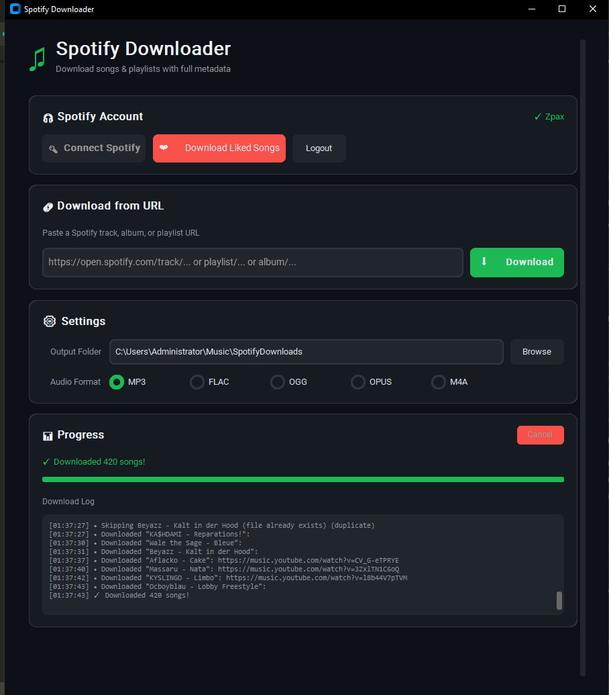

<p align="center">
  
</p>

<h1 align="center">Spotify Downloader</h1>

<p align="center">
  <strong>A modern, fast GUI application to download your Spotify music with full metadata</strong>
</p>

<p align="center">
  <a href="#features">Features</a> •
  <a href="#installation">Installation</a> •
  <a href="#usage">Usage</a> •
  <a href="#liked-songs">Liked Songs</a> •
  <a href="#screenshots">Screenshots</a> •
  <a href="#community">Discord</a>
</p>

<p align="center">
  <a href="https://discord.gg/cUnMNDAm2z">
    
  </a>
  
  
  
</p>

---

> **Download Spotify songs, playlists, albums, and your entire Liked Songs library to MP3, FLAC, or other formats with embedded metadata, album art, and lyrics.**

---

## Features

- **Download Any Spotify Content** - Tracks, albums, playlists, and artist top songs
- **Liked Songs Support** - Download your entire Liked Songs library with one click
- **Full Metadata** - Album art, lyrics, artist info, and more embedded in every file
- **Multiple Formats** - MP3, FLAC, OGG, OPUS, M4A
- **Fast Parallel Downloads** - 8 concurrent downloads for maximum speed
- **Persistent Login** - Connect once, stay logged in
- **Modern Dark UI** - Clean, smooth interface built with CustomTkinter
- **Cross-Platform** - Works on Windows, macOS, and Linux

## Installation

### Prerequisites

- Python 3.8 or higher
- FFmpeg (can be installed automatically)

### Quick Start

1. **Clone the repository**
   ```bash
   git clone https://github.com/yourusername/spotify-downloader.git
   cd spotify-downloader
   ```

2. **Install dependencies**
   ```bash
   pip install -r requirements.txt
   ```

3. **Run the application**
   ```bash
   python main.py
   ```

4. **Install FFmpeg** (if not already installed)
   - Click the "Install FFmpeg" button in the app, or
   - Run: `spotdl --download-ffmpeg`

## Usage

### Download from URL

1. Copy any Spotify URL (track, album, or playlist)
2. Paste it into the URL field
3. Click **Download**

Supported URL formats:
```
https://open.spotify.com/track/...
https://open.spotify.com/album/...
https://open.spotify.com/playlist/...
```

### Settings

- **Output Folder** - Choose where to save your music
- **Audio Format** - Select your preferred format (MP3, FLAC, OGG, OPUS, M4A)

## Liked Songs

To download your Liked Songs, you need to connect your Spotify account:

### One-Time Setup

1. Go to [Spotify Developer Dashboard](https://developer.spotify.com/dashboard)
2. Click **Create App**
3. Fill in:
   - App name: `My Downloader` (or anything you want)
   - App description: `Personal use`
   - Redirect URI: `http://127.0.0.1:8888/callback`
4. Save and copy your **Client ID**

### Connect in the App

1. Click **Connect Spotify**
2. Paste your Client ID
3. Authorize in the browser that opens
4. Copy the callback URL and paste it back

Your login is saved automatically - you won't need to do this again!

### Download Your Library

1. Click **Download Liked Songs**
2. Enter how many songs to download (or "all")
3. Watch your music download with 8x parallel speed

## Screenshots

<p align="center">
  
</p>

<p align="center">
  <em>Modern dark interface with Spotify integration and parallel downloads</em>
</p>

## Tech Stack

- **[spotdl](https://github.com/spotDL/spotify-downloader)** - Core download engine
- **[CustomTkinter](https://github.com/TomSchimansky/CustomTkinter)** - Modern UI framework
- **[Spotipy](https://github.com/spotipy-dev/spotipy)** - Spotify Web API client

## Configuration

Config files are stored in `~/.spotdl/`:
- `app_config.json` - Your Client ID
- `.spotify_cache` - Authentication token

## Troubleshooting

### "No results found" for some songs
Some songs may not be available on YouTube Music. These are automatically skipped.

### Download is slow
Make sure you have a stable internet connection. The app downloads 8 songs in parallel by default.

### FFmpeg errors
Run `spotdl --download-ffmpeg` or install FFmpeg manually for your system.

### Login issues
1. Make sure your redirect URI is exactly `http://127.0.0.1:8888/callback`
2. Delete `~/.spotdl/.spotify_cache` and try again

## Legal Disclaimer

This tool is for personal use only. Respect copyright laws and Spotify's Terms of Service. Only download music you have the right to access.

## License

MIT License - feel free to use and modify.

## Community

Have questions, issues, or just want to chat? Join our Discord!

<p align="center">
  <a href="https://discord.gg/cUnMNDAm2z">
    
  </a>
</p>

## Contributing

Contributions are welcome! Feel free to open issues or submit pull requests.

---

## Keywords

`spotify downloader` `spotify to mp3` `download spotify songs` `spotify playlist downloader` `spotify music downloader` `liked songs downloader` `spotify ripper` `spotify converter` `download spotify playlist` `spotify to flac` `free spotify downloader` `spotify download tool` `batch spotify download` `spotify library downloader`

---

<p align="center">
  Made with ❤️ for music lovers
</p>
